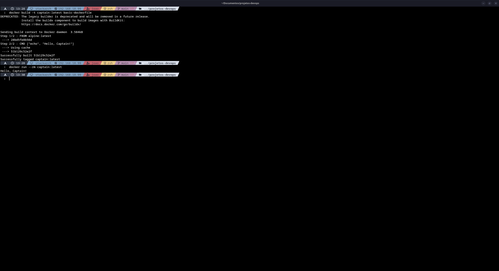

# basic-dockerfile

Mini projeto: imagem Docker mínima baseada em Alpine que imprime uma mensagem.

## O que tem aqui

Arquivos
- `Dockerfile` — imagem baseada em `alpine:latest` que executa `echo "Hello, Captain!"` como comando padrão.

## Como usar

1. Build da imagem

```bash
# a partir da raiz do repositório
docker build -t captain:latest basic-dockerfile/
```

2. Executar o container

```bash
docker run --rm captain:latest
# Saída esperada: Hello, Captain!
```

## Captura de tela

Exemplo de saída ao executar a imagem:




## Notas

- A imagem usa `alpine:latest`, portanto é muito pequena e adequada para testes rápidos.
- Para debugging, adicione um `ENTRYPOINT` ou crie uma imagem interativa com `sh`.

## Licença

MIT